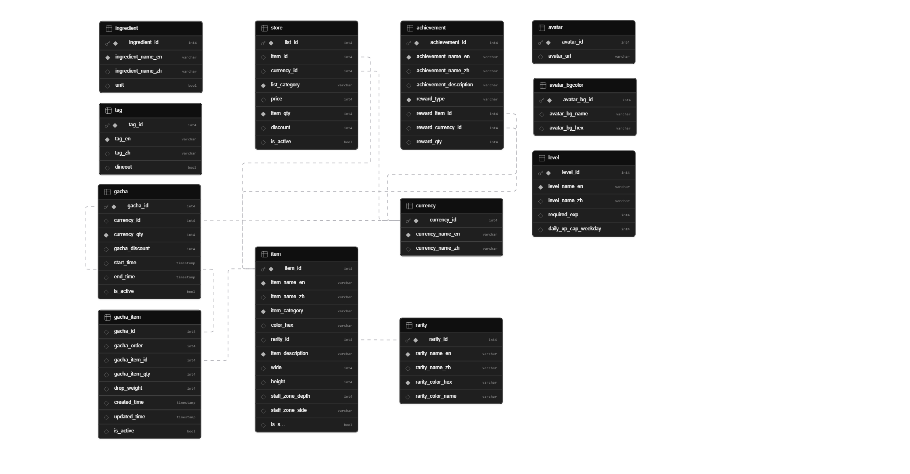

# 🍯 HoneyShop: A Food Journaling App with Gamification
~ Log Meals · Earn Honeypots · Decorate Your Shop ~

## Features
- Log recipes and dining experiences to earn Honeypot currency
- Watch real-life food efforts turn into a thriving virtual restaurant
- Customize your shop with furniture, decorations, and wall & floor items
- Pull exclusive gacha items using Bagel Tokens earned from logging
- Unlock achievements and collect rewards as you progress
- Invite family, friends, and characters to walk around your restaurant

## Tech Stack
- **React 18** + **Vite** (single-page web app, no backend)
- All state persisted via `localStorage`
- Target device: **iPhone 17** — 402 × 874 CSS px (2622 × 1206 physical, 3× DPR)
- Local dev server runs on `http://localhost:3000`

## Running Locally

```bash
npm install      # first time only
npm run dev      # starts dev server at localhost:3000
```

## Project Structure

```
HoneyShop/
├── src/
│   ├── main.jsx          # React entry point (createRoot)
│   └── App.jsx           # Entire app — all components & data tables in one file
│
├── public/
│   └── images/
│       ├── avatars/      # User & NPC avatar images
│       ├── furniture/    # Shop decoration images  {name}_WxH.png
│       └── currency/     # In-app currency icons (honeypot, bagel)
│
├── index.html
├── vite.config.js
├── package.json
└── README.md
```

## Data Tables 

- user_data_schema
- analytics_schema

## App Tabs

| Tab | Key Component | Description |
|---|---|---|
| 📓 Journal | `JournalTab` | Log home-cook or dining entries, earn Honeypot |
| 🧊 Fridge | `FridgeTab` | Track ingredient stock & expiry dates | **[Coming Soon]**
| 🏪 Shop | `ShopTab` | Decorate restaurant, manage NPCs, view stats |
| 🛒 Store | `StoreTab` → `ShopBuyView` / `GachaView` | Buy items or pull gacha with Bagel Tokens |
| 🏆 Collection | `CollectionTab` | Achievements with reward slots; Collection **[Coming Soon]**|

## Currency

| Currency | Earned by | Spent on |
|---|---|---|
| 🍯 Honeypot | Logging entries (+80 cook / +50 dine) | Buying items in Shop |
| 🥯 Bagel Token | Every 5 entries logged | Gacha pulls (1 token/pull) |