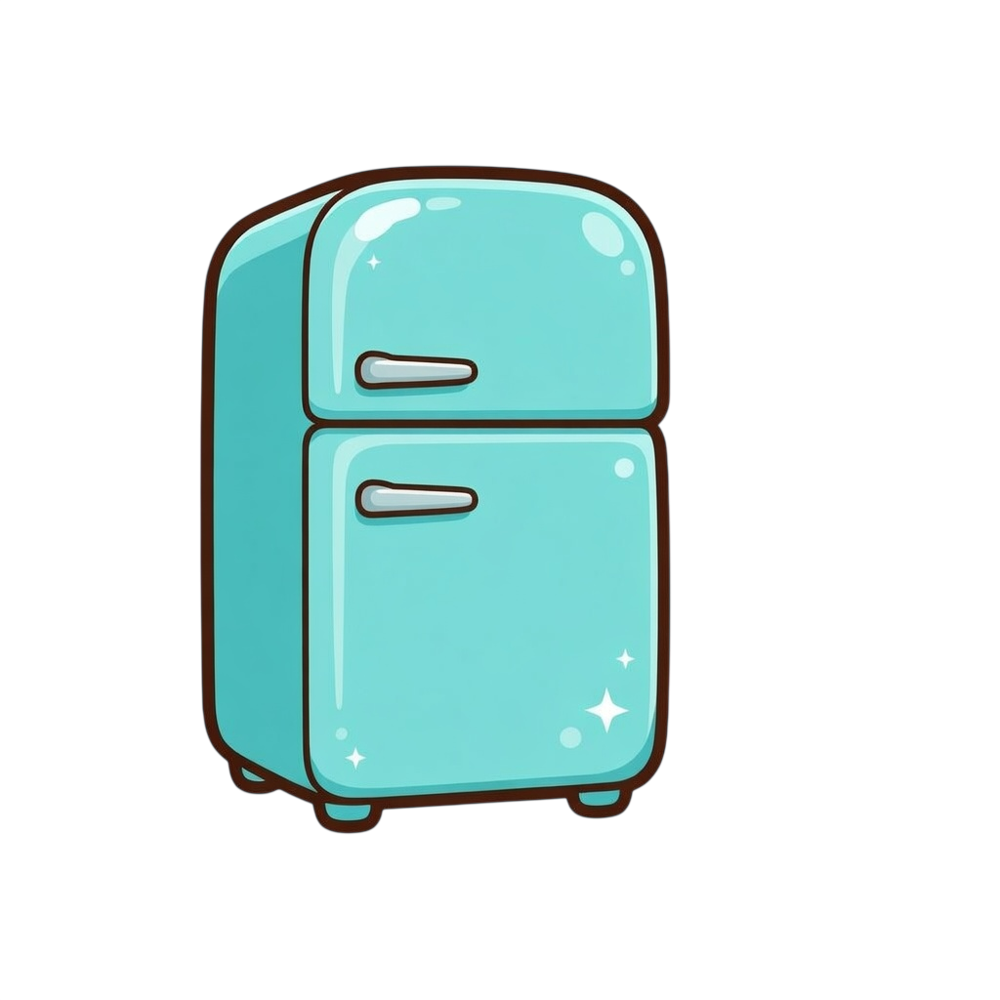
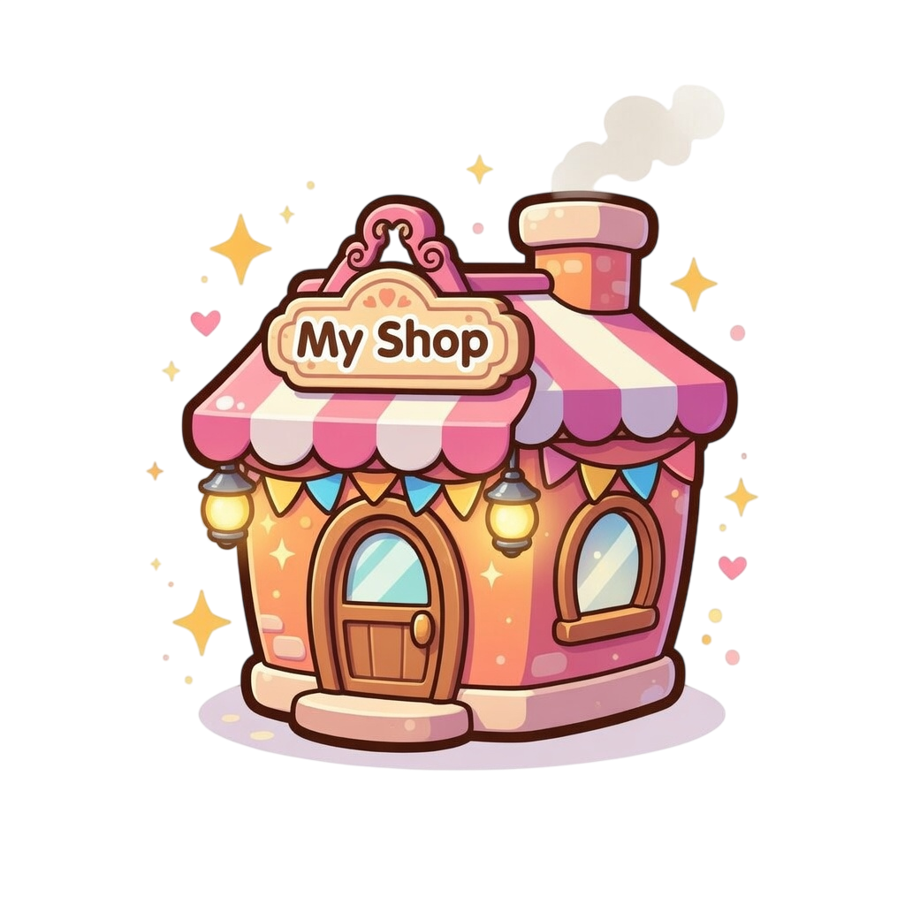

#  HoneyShop: A Food Journaling App with Gamification
~ Log Meals · Earn Honeypots · Decorate Your Shop ~

## Features
- Log recipes and dining experiences to earn Honeypot currency
- Watch real-life food efforts turn into a thriving virtual restaurant
- Customize your shop with furniture, decorations, and wall & floor items
- Pull exclusive gacha items using Bagel Tokens earned from logging
- Unlock achievements and collect rewards as you progress
- Invite family, friends, and characters to walk around your restaurant

## Tech Stack
- **React 18** + **Vite** (single-page web app)
- State persisted via `localStorage`; live data from **Supabase** (PostgreSQL)
- Supabase schema: `core` — tables: `tag`, `item`, `store`, `gacha`, `gacha_item`, `ingredient`, `avatar`, `avatar_bgcolor`, `rarity`, `currency`, `level`, `achievement`
- Target device: **iPhone 17** — 402 × 874 CSS px (2622 × 1206 physical, 3× DPR)
- Local dev server runs on `http://localhost:3000`

## Running Locally

```bash
npm install      # first time only
npm run dev      # starts dev server at localhost:3000
```

## Project Structure

```
HoneyShop/
├── src/
│   ├── main.jsx              # React entry point (createRoot)
│   ├── App.jsx               # Main shell — state, routing, header, bottom nav
│   ├── constants.js          # Data tables (items, gacha, tags, achievements…) + design tokens
│   ├── state.js              # localStorage load/save + defaults
│   ├── lib/
│   │   └── supabase.js       # Supabase client (reads VITE_SUPABASE_* env vars)
│   ├── components/
│   │   ├── Lightbox.jsx          # Full-screen photo viewer (click-to-expand)
│   │   ├── AchievementToast.jsx  # Push-notification style achievement popup
│   │   └── DevPanel.jsx          # Dev-only cheat panel (hidden in production)
│   ├── tabs/
│   │   ├── JournalTab.jsx    # Food journal + filter/sort bar + record cards
│   │   ├── FridgeTab.jsx     # Ingredient stock & expiry tracking
│   │   ├── ShopTab.jsx       # Restaurant view, furniture, NPCs, shop info
│   │   ├── StoreTab.jsx      # Honeypot shop + gacha pulls
│   │   └── CollectionTab.jsx # Achievements & rewards
│   └── modals/
│       ├── AddModal.jsx      # Multi-step entry form (type → photos → details → confirm)
│       ├── GachaModal.jsx    # Gacha pull animation & result
│       ├── ProfileModal.jsx  # Profile editor + avatar/background picker
│       └── RecordModal.jsx   # Journal entry detail view + save-to-photo
│
├── public/
│   └── images/
│       ├── avatars/          # User avatar images (e.g. 01_rabbit.png)
│       ├── furniture/        # Shop decoration images  {name}_WxH.png
│       ├── currency/         # In-app currency icons (honeypot, bagel)
│       └── icon/             # UI icons (setting.png, spatula_click.png, plate.png, pin.png …)
│
├── .env                      # VITE_SUPABASE_URL / VITE_SUPABASE_ANON_KEY
├── index.html
├── vite.config.js
├── package.json
└── README.md
```

## Data Tables 

- user_data_schema
- analytics_schema

## App Tabs

| Tab | Key Component | Description |
|---|---|---|
|  Journal | `JournalTab` | Log home-cook or dining entries, earn Honeypot |
|  Fridge | `FridgeTab` | Track ingredient stock & expiry dates with live DB search |
|  My Shop | `ShopTab` | Decorate restaurant, manage NPCs, view stats |
|  Store | `StoreTab` | Buy items or pull gacha with Bagel Tokens |
|  Collection | `CollectionTab` | Achievements with reward slots **[Coming Soon]** |

## Currency

| Currency | Earned by | Spent on |
|---|---|---|
|  Honeypot | Logging entries (+80 cook / +50 dine) | Buying items in Shop |
|  Bagel | Earning from achievement or mission | Gacha pulls |

## Changelog

### 2026-05-19
- **Fridge tab fully implemented**
- Name field connected to Supabase `ingredient` table (live search with 280 ms debounce)
- Unified UI of all pages

### 2026-05-08
- **Achievements now load from Supabase** (`core.achievement`)
- **All 37 achievements** shown in Collection tab (up from 15 hardcoded)
- **Rewards are now granted on unlock**

### 2026-05-07
- Added **Achievement Toast** — push-notification style popup replacing the old gold toast
- Added **DevPanel** (dev-only)

### 2026-04-23
- Bug fixes: Supabase null guard, DST-safe streak calculation, zero-padded date display
- Performance: key callbacks memoized with `useCallback` / `useMemo`; storage quota error now shows user-facing toast

### 2026-04-17
- Save button on RecordModal exports entry card as PNG (Web Share on mobile, download on desktop)
- Journal: sticky **filter/sort bar** added (Recipe / Review tabs + sort by date or meal time)

### 2026-04-15
- Edit entry flow implemented — Edit pre-fills AddModal with existing data
- ProfileModal: Favourite Tags replaced with chip search overlay, loaded from Supabase

### 2026-04-14
- Refactored `App.jsx` into modular structure — tabs into `src/tabs/`, modals into `src/modals/`, data into `src/constants.js`, localStorage into `src/state.js`

### 2026-04-12
- Supabase integration: avatar and background color loaded from `core` schema
- Header XP bar moved to full-width second row

### 2026-04-08
- Initial release: Journal, Shop, Store (gacha), Fridge, Collection tabs

---
## 👤 Author
Ricy Hsu

---
## 📅 Last Updated
May 19, 2026
